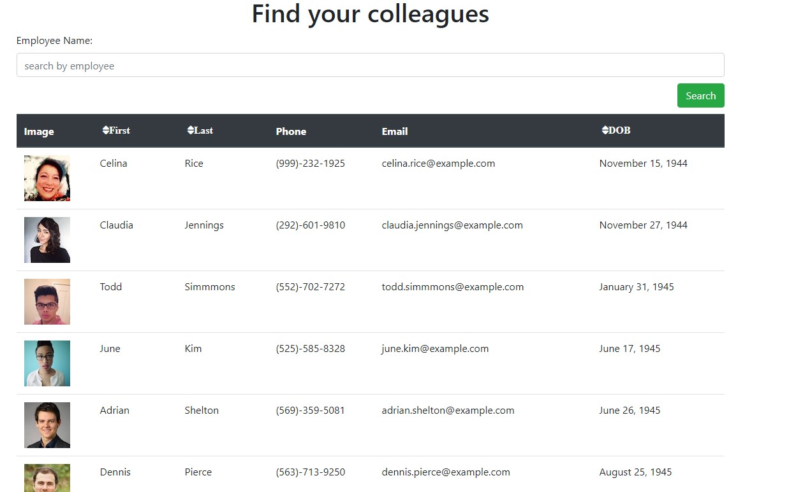
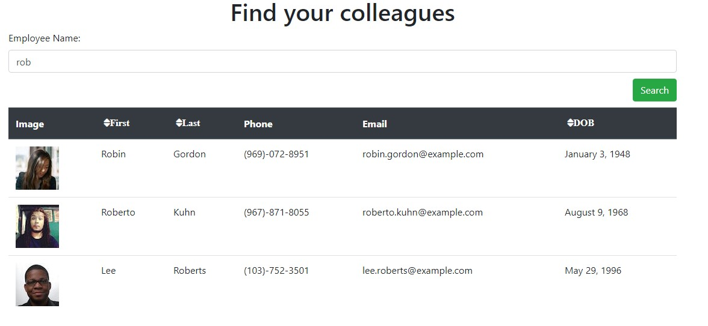

# Employee Directory

Link to application: https://brentp24.github.io/employee-directory/

## Overview

This app shows your company directory that allows you to search first and/or last names and lets you sort by first or last name or date of birth.   

## User Story

* As a user, I want to be able to view my entire employee directory at once so that I have quick access to their information.

## Business Context

An employee or manager would benefit greatly from being able to view non-sensitive data about other employees. It would be particularly helpful to be able to filter employees by name.

## Tech Used:
1. JavaScript
2. HTML
3. CSS
4. Node JS
5. React

### Contributors
| [Brent Peterson](https://github.com/brentp24) | 

### Future Development
1. Login
2. Actual data
3. Click into cards of people with more info

